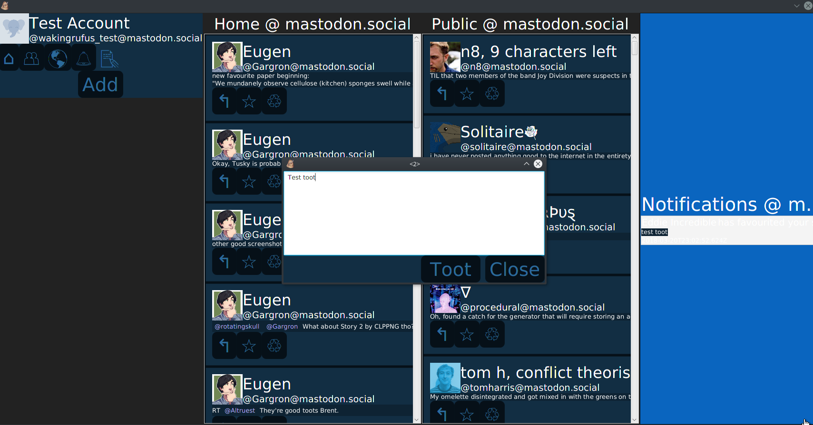
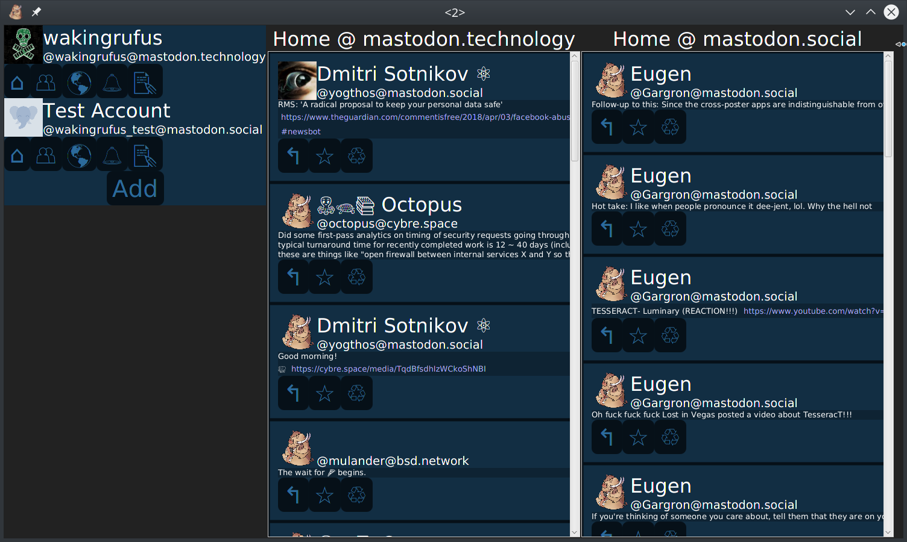

# mastodon-jfx
mastodon-jfx is a desktop client for [Mastodon](joinmastodon.org) 
written in kotlin using [TornadoFX](https://github.com/edvin/tornadofx).
It is designed for power tooters, particularly ones with multiple accounts spanning multiple instances.
It is currently in an Alpha state. It is not yet feature-complete and the Look & Feel is in progress.

mastodon-jfx is available as a portable zip or a *.deb package.
Download mastodon-jfx [here](https://github.com/wakingrufus/mastodon-jfx/wiki/Download)

### Screenshots

#### Main UI

#### Authoring a toot

#### Multiple Accounts

### Implemented features:
- Log in to multiple accounts
- View Home, public, and federated feeds (with real-time updates)
- view notifications
- boost/unboost toots
- favorite/unfavorite toots
- post toots
- reply to toots

### Not yet implemented:
- view account
- view #tag feed
- scroll back history